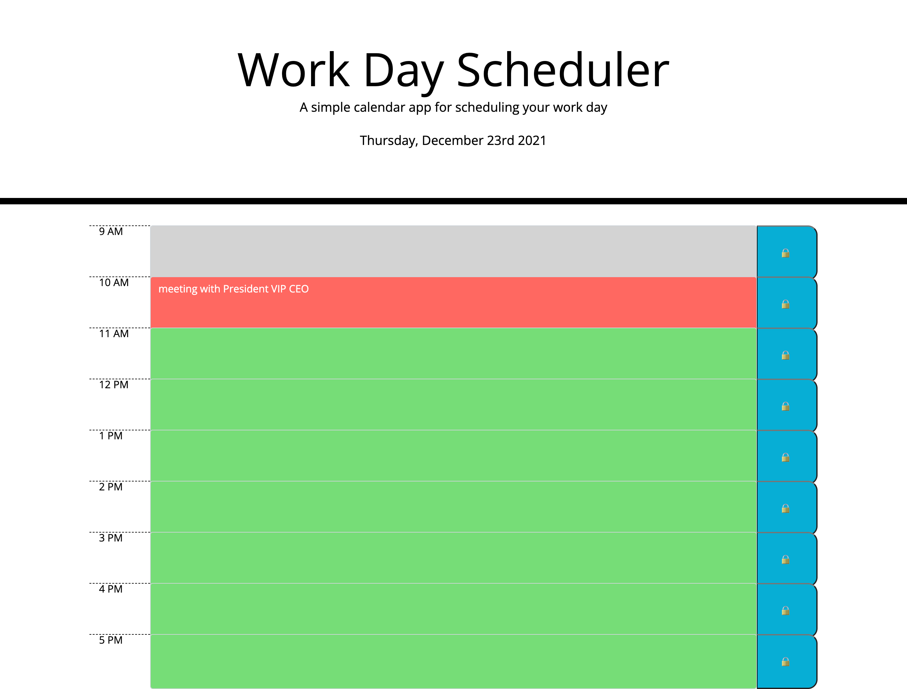

# Day Planner

The project is a daily work planner, with timeslots representing average working hours (9am to 5pm) where the user can enter and save their work commitments. The application was built through modifying existing starter code, and makes use of HTML, CSS, Javascript and a variety of third party APIs such as Bootstrap, Jquery and Moment js.

The planner:

<li> displays the current date at the top of the page </li>
<li> shows timeblocks representing average business hours (9am to 5pm) </li>
<li> allows the user to enter and save information into each timeblock. This information is stored in Local Storage and can be viewed even if the users refreshes or closes the browser window </li>
<li> colour codes timeblocks depending on local time. The timeblock representing the current hour will be red. Past events will be coloured grey, while future events will be displayed with a green background.</li>

 

The application can be viewed here: <a href="https://ekubik.github.io/week-five-day-planner/"> https://ekubik.github.io/week-five-day-planner/ </a>
 

